# Food Donation - Connect, Donate, Nourish 🍲

Food Donation is a modern Flutter application designed to bridge the gap between surplus food providers (Shopkeepers) and those in need (Receivers). It facilitates real-time food donations with a focus on ease of use, transparency, and community impact.

---

## 📸 App Preview

### Authentication & Main
| Main Login | Shopkeeper Login | Receiver Login |
|:---:|:---:|:---:|
| 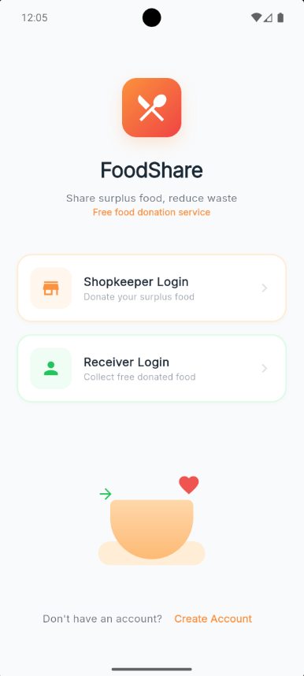 | 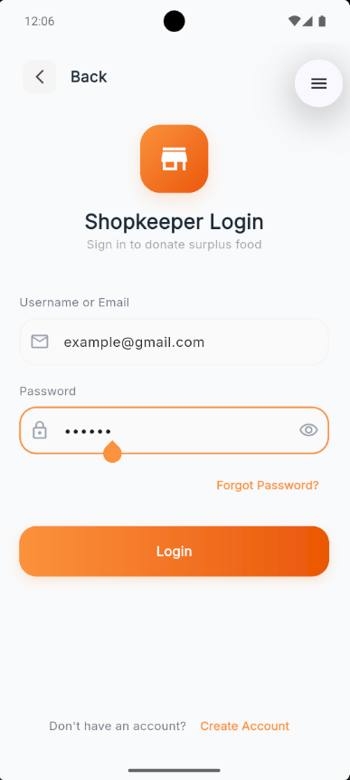 | 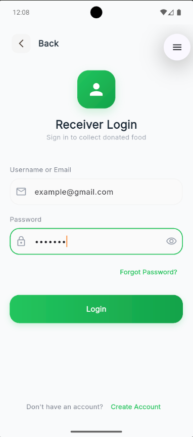 |

### Shopkeeper Experience 🏪
| Dashboard | Inventory Library | Requests |
|:---:|:---:|:---:|
| 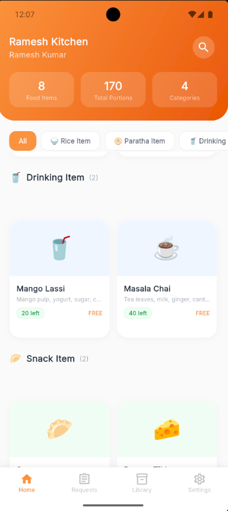 | 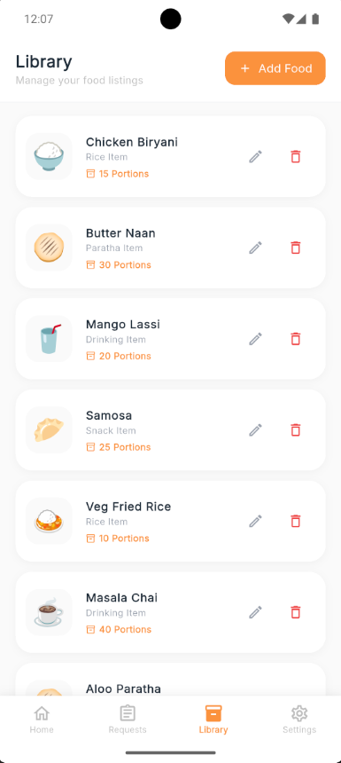 | 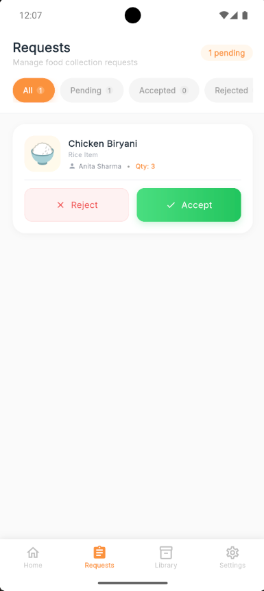 |

| Shop Details | Settings |
|:---:|:---:|
| 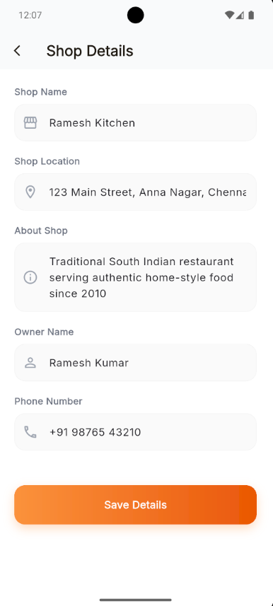 | 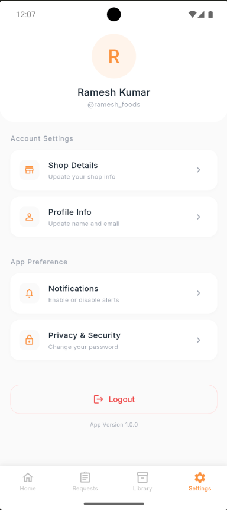 |

### Receiver Experience 🥗
| Discovery Feed | Food Details | Nearby Locations |
|:---:|:---:|:---:|
| 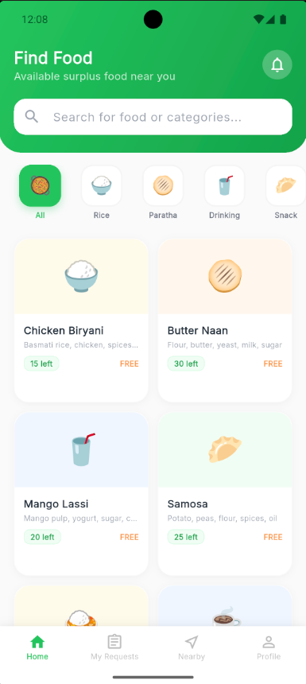 | 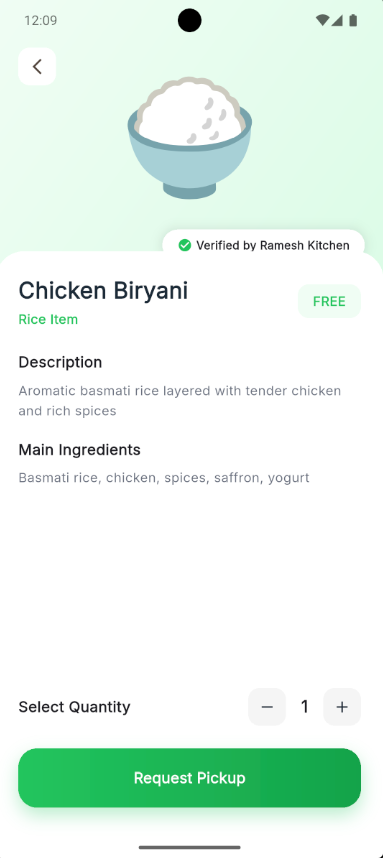 | 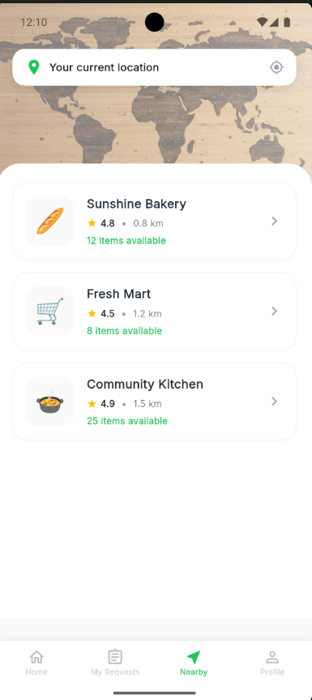 |

| Success Screen | Settings |
|:---:|:---:|
| 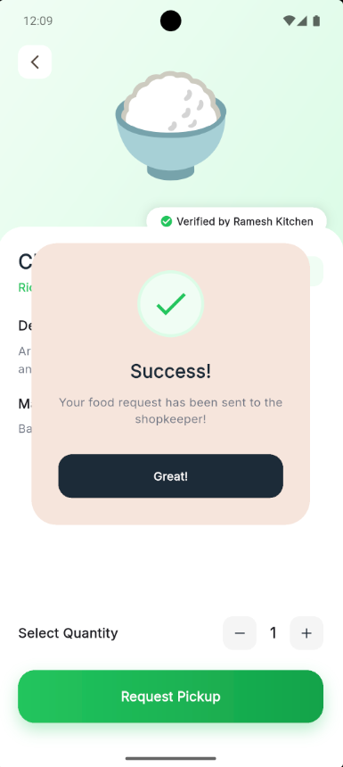 | 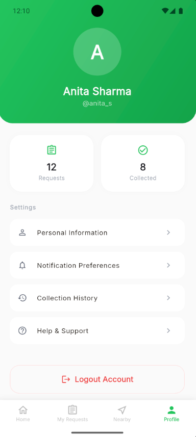 |

---

## 🛠 Tech Stack

- **Frontend**: [Flutter](https://flutter.dev/) (Dart)
- **State Management**: [Provider](https://pub.dev/packages/provider)
- **Networking**: [Dio](https://pub.dev/packages/dio) (HTTP/REST)
- **Real-time**: [WebChannel](https://pub.dev/packages/web_socket_channel) (WebSockets)
- **Storage**: [Shared Preferences](https://pub.dev/packages/shared_preferences)
- **Design**: Vanilla Material Design with Custom Glassmorphism effects

---

## 📁 Project Structure

The project follows a clean, feature-based directory structure for maximum maintainability:

```text
lib/
├── models/             # Data models with JSON serialization
│   ├── food.dart
│   ├── food_request.dart
│   └── profile_details.dart
├── pages/              # UI Screens grouped by feature/role
│   ├── login/          # Authentication screens (Shopkeeper/Receiver)
│   ├── signup/         # User registration
│   ├── shopkeeper/     # Dashboard, Inventory, and Request management
│   └── receiver/       # Discovery, Requests, and Profile
├── providers/          # State management (AppProvider)
├── services/           # External service integrations
│   ├── api_service.dart    # REST API client (Dio)
│   └── socket_service.dart # WebSocket manager
├── theme/              # Centralized styling and color tokens
└── widgets/            # Reusable UI components
    ├── common/         # Buttons, Inputs, Cards
    └── modals/         # Success/Error overlays
```

---

## 🚀 Key Features

### For Shopkeepers 🏪
- **Inventory Management**: Create, update, and delete food listings with Cloudinary-backed images.
- **Request Management**: Receive instant WebSocket notifications for new collection requests.
- **Real-time Status**: Accept or reject requests with immediate feedback to the receiver.

### For Receivers 🥗
- **Discovery Feed**: Browse available food donations near you with category filters.
- **Instant Requests**: Select quantities and send collection requests to shopkeepers.
- **Track Status**: Monitor your requests in real-time as they are processed.

---

## 🔌 Backend Integration

The app is connected to a production-grade Node.js/MongoDB backend.

- **Backend Repository**: [devikavinod224/FoodDonationBackend](https://github.com/devikavinod224/FoodDonationBackend)
- **API Endpoint**: `https://fooddonationbackend.onrender.com`
- **WS Endpoint**: `wss://fooddonationbackend.onrender.com/ws`

### Security
- **JWT Authentication**: Secure login/signup with token persistence.
- **Interceptors**: Automatic auth token inclusion in all sensitive API requests.
- **Environment Safety**: Sensitive keys managed via server-side environment variables.

---

## ⚙️ Setup & Installation

1. **Clone the repository**:
   ```bash
   git clone https://github.com/yourusername/FoodDonationFlutter.git
   ```

2. **Install dependencies**:
   ```bash
   flutter pub get
   ```

3. **Run the application**:
   ```bash
   flutter run
   ```

---

## 🤝 Contribution

Contributions are welcome! Please read the contribution guidelines before submitting a pull request.

---

## 📄 License

This project is licensed under the MIT License - see the [LICENSE](LICENSE) file for details.
